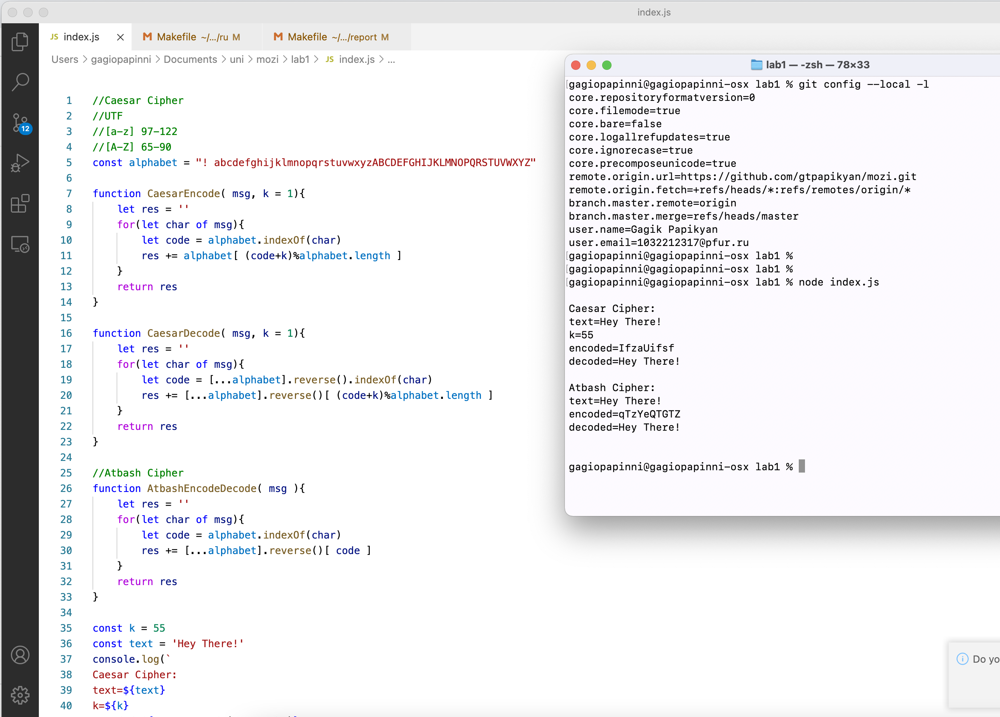

---
# Front matter
title: "Отчёт по лабораторной работе 1"
subtitle: "МОЗИиИБ"
author: "Папикян Гагик Тигранович"

# Generic otions
lang: ru-RU
toc-title: "Содержание"

# Bibliography
# bisbliography: bib/cite.bib
csl: pandoc/csl/gost-r-7-0-5-2008-numeric.csl

# Pdf output format
toc: true # Table of contents
toc_depth: 2
lof: true # List of figures
lot: true # List of tables
fontsize: 12pt
linestretch: 1.5
papersize: a4
documentclass: scrreprt
## I18n
polyglossia-lang:
  name: russian
  options:
	- spelling=modern
	- babelshorthands=true
polyglossia-otherlangs:
  name: english
### Fonts
mainfont: PT Serif
romanfont: PT Serif
sansfont: PT Sans
monofont: PT Mono
mainfontoptions: Ligatures=TeX
romanfontoptions: Ligatures=TeX
sansfontoptions: Ligatures=TeX,Scale=MatchLowercase
monofontoptions: Scale=MatchLowercase,Scale=0.9
## Biblatex
# biblatex: true
# biblio-style: "gost-numeric"
# biblatexoptions:
#   - parentracker=true
#   - backend=biber
#   - hyperref=auto
#   - language=auto
#   - autolang=other*
#   - citestyle=gost-numeric
## Misc options
indent: true
header-includes:
  - \linepenalty=10 # the penalty added to the badness of each line within a paragraph (no associated penalty node) Increasing the value makes tex try to have fewer lines in the paragraph.
  - \interlinepenalty=0 # value of the penalty (node) added after each line of a paragraph.
  - \hyphenpenalty=50 # the penalty for line breaking at an automatically inserted hyphen
  - \exhyphenpenalty=50 # the penalty for line breaking at an explicit hyphen
  - \binoppenalty=700 # the penalty for breaking a line at a binary operator
  - \relpenalty=500 # the penalty for breaking a line at a relation
  - \clubpenalty=150 # extra penalty for breaking after first line of a paragraph
  - \widowpenalty=150 # extra penalty for breaking before last line of a paragraph
  - \displaywidowpenalty=50 # extra penalty for breaking before last line before a display math
  - \brokenpenalty=100 # extra penalty for page breaking after a hyphenated line
  - \predisplaypenalty=10000 # penalty for breaking before a display
  - \postdisplaypenalty=0 # penalty for breaking after a display
  - \floatingpenalty = 20000 # penalty for splitting an insertion (can only be split footnote in standard LaTeX)
  - \raggedbottom # or \flushbottom
  - \usepackage{float} # keep figures where there are in the text
  - \floatplacement{figure}{H} # keep figures where there are in the text
---

# Цель работы

Познакомиться с простейшими алгоритмами шифрования данных, 
посредством реализации шифра Цезаря и Атбаш

# Задание

1) Реализовать шифр Цезаря с ключом К
2) Реализовать шифр Атбаш

# Теоретическое введение

## Принцип работы симметричных алгоритмов

В целом симметричным считается любой шифр, использующий один и тот же секретный ключ для шифрования и расшифровки.

Например, если алгоритм предполагает замену букв числами, то и у отправителя сообщения, и у его получателя должна быть одна и та же таблица соответствия букв и чисел: первый с ее помощью шифрует сообщения, а второй — расшифровывает.

Однако такие простейшие шифры легко взломать — например, зная частотность разных букв в языке, можно соотносить самые часто встречающиеся буквы с самыми многочисленными числами или символами в коде, пока не удастся получить осмысленные слова. С использованием компьютерных технологий такая задача стала занимать настолько мало времени, что использование подобных алгоритмов утратило всякий смысл.

## Шифр Цезаря
Шифр Цезаря, также известный как шифр сдвига, код Цезаря или сдвиг Цезаря — один из самых простых и наиболее широко известных методов шифрования.

Шифр Цезаря — это вид шифра подстановки, в котором каждый символ в открытом тексте заменяется символом, находящимся на некотором постоянном числе позиций левее или правее него в алфавите. Например, в шифре со сдвигом вправо на 3, А была бы заменена на Г, Б станет Д, и так далее.

Шифр назван в честь римского полководца Гая Юлия Цезаря, использовавшего его для секретной переписки со своими генералами.

Шаг шифрования, выполняемый шифром Цезаря, часто включается как часть более сложных схем, таких как шифр Виженера, и всё ещё имеет современное приложение в системе ROT13. Как и все моноалфавитные шифры, шифр Цезаря легко взламывается и не имеет почти никакого применения на практике.

## Шифр Атба́ш
Атба́ш — простой шифр подстановки для алфавитного письма. Правило шифрования состоит в замене i-й буквы алфавита буквой с номером n-i+1, где n — число букв в алфавите. Ниже даны примеры для английского, русского и еврейского алфавитов:

# Выполнение лабораторной работы
Был написан следующий скрипт на javascript

``` {.js filename="../index.js"}
//Caesar Cipher
//UTF
//[a-z] 97-122
//[A-Z] 65-90
const alphabet = "! abcdefghijklmnopqrstuvwxyzABCDEFGHIJKLMNOPQRSTUVWXYZ"

function CaesarEncode( msg, k = 1){
    let res = ''
    for(let char of msg){
        let code = alphabet.indexOf(char)
        res += alphabet[ (code+k)%alphabet.length ]
    }
    return res
}

function CaesarDecode( msg, k = 1){
    let res = ''
    for(let char of msg){
        let code = [...alphabet].reverse().indexOf(char)
        res += [...alphabet].reverse()[ (code+k)%alphabet.length ]
    }
    return res
}

//Atbash Cipher
function AtbashEncodeDecode( msg ){
    let res = ''
    for(let char of msg){
        let code = alphabet.indexOf(char)
        res += [...alphabet].reverse()[ code ]
    }
    return res
}

const k = 55
const text = 'Hey There!'
console.log(`
Caesar Cipher:
text=${text}
k=${k}
encoded=${CaesarEncode( text, k )}
decoded=${ CaesarDecode( CaesarEncode( text, k ), k)}

Atbash Cipher:
text=${text}
encoded=${AtbashEncodeDecode( text )}
decoded=${ AtbashEncodeDecode( AtbashEncodeDecode( text ))}

`)
```

Результат исполнения скрипта приведен на рисунке 1 (рис. [-@fig:001])

{ #fig:001 width=70% }

# Выводы

Был реализован Шифр Цезаря с произвольным ключом и Шифр Атбаша
Был использован фиксированный алфавит, состоящий из символов "! abcdefghijklmnopqrstuvwxyzABCDEFGHIJKLMNOPQRSTUVWXYZ"


На рисунке 4.1 в окне терминала было показано, как текст "Hey There!" зашифровывается и расшифровывается сначала алгоритмом Цезаря, потом Атбаш

<!-- 
# Список литературы{.unnumbered}

::: {#refs}
::: -->
