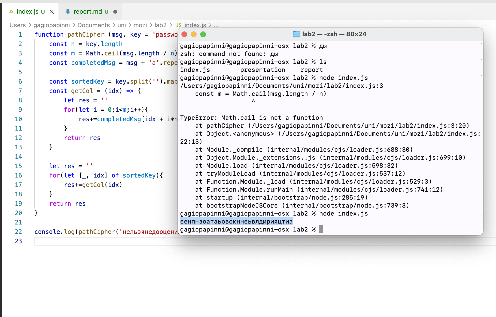

---
# Front matter
title: "Отчёт по лабораторной работе 2"
subtitle: "МОЗИиИБ"
author: "Папикян Гагик Тигранович"

# Generic otions
lang: ru-RU
toc-title: "Содержание"

# Bibliography
# bisbliography: bib/cite.bib
csl: pandoc/csl/gost-r-7-0-5-2008-numeric.csl

# Pdf output format
toc: true # Table of contents
toc_depth: 2
lof: true # List of figures
lot: true # List of tables
fontsize: 12pt
linestretch: 1.5
papersize: a4
documentclass: scrreprt
## I18n
polyglossia-lang:
  name: russian
  options:
	- spelling=modern
	- babelshorthands=true
polyglossia-otherlangs:
  name: english
### Fonts
mainfont: PT Serif
romanfont: PT Serif
sansfont: PT Sans
monofont: PT Mono
mainfontoptions: Ligatures=TeX
romanfontoptions: Ligatures=TeX
sansfontoptions: Ligatures=TeX,Scale=MatchLowercase
monofontoptions: Scale=MatchLowercase,Scale=0.9
## Biblatex
# biblatex: true
# biblio-style: "gost-numeric"
# biblatexoptions:
#   - parentracker=true
#   - backend=biber
#   - hyperref=auto
#   - language=auto
#   - autolang=other*
#   - citestyle=gost-numeric
## Misc options
indent: true
header-includes:
  - \linepenalty=10 # the penalty added to the badness of each line within a paragraph (no associated penalty node) Increasing the value makes tex try to have fewer lines in the paragraph.
  - \interlinepenalty=0 # value of the penalty (node) added after each line of a paragraph.
  - \hyphenpenalty=50 # the penalty for line breaking at an automatically inserted hyphen
  - \exhyphenpenalty=50 # the penalty for line breaking at an explicit hyphen
  - \binoppenalty=700 # the penalty for breaking a line at a binary operator
  - \relpenalty=500 # the penalty for breaking a line at a relation
  - \clubpenalty=150 # extra penalty for breaking after first line of a paragraph
  - \widowpenalty=150 # extra penalty for breaking before last line of a paragraph
  - \displaywidowpenalty=50 # extra penalty for breaking before last line before a display math
  - \brokenpenalty=100 # extra penalty for page breaking after a hyphenated line
  - \predisplaypenalty=10000 # penalty for breaking before a display
  - \postdisplaypenalty=0 # penalty for breaking after a display
  - \floatingpenalty = 20000 # penalty for splitting an insertion (can only be split footnote in standard LaTeX)
  - \raggedbottom # or \flushbottom
  - \usepackage{float} # keep figures where there are in the text
  - \floatplacement{figure}{H} # keep figures where there are in the text
---

# Цель работы

Познакомиться с простейшими алгоритмами шифрования данных, 
посредством реализации алгоритмов шифрования на основе перестановок

# Задание

1) Реализовать Маршрутное шифрование 
2) Реализовать шифрование  с помощю решеток
3) Реализовать шифрование на основе таблицы Виженера

# Теоретическое введение

## Шифры перестановки

Шифр перестано́вки — это метод симметричного шифрования, в котором элементы исходного открытого текста меняют местами. Элементами текста могут быть отдельные символы (самый распространённый случай), пары букв, тройки букв, комбинирование этих случаев и так далее. Типичными примерами перестановки являются анаграммы. В классической криптографии шифры перестановки можно разделить на два класса:

Шифры одинарной (простой) перестановки — при шифровании символы открытого текста перемещаются с исходных позиций в новые один раз.
Шифры множественной (сложной) перестановки — при шифровании символы открытого текста перемещаются с исходных позиций в новые несколько раз.
В качестве альтернативы шифрам перестановки можно рассматривать подстановочные шифры. В них элементы текста не меняют свою последовательность, а изменяются сами.

## Шифр вертикальной перестановки
Широкое распространение получила разновидность маршрутной перестановки — вертикальная перестановка. В этом шифре также используется прямоугольная таблица, в которую сообщение записывается по строкам слева направо. Выписывается шифрограмма по вертикалям, при этом столбцы выбираются в порядке, определяемом ключом.

## Шифр «поворотная решётка»

Решётка Кардано
В 1550 году итальянский математик Джероламо Кардано (1501—1576) в книге «О тонкостях» предложил новую технику шифрования сообщений — решётку.

Изначально решётка Кардано представляла собой трафарет с отверстиями, в которые записывали буквы, слоги или слова сообщения. Затем трафарет убирали, а свободное место заполняли более или менее осмысленным текстом. Такой метод сокрытия информации относится к стеганографии.

Позднее был предложен шифр «поворотная решётка» — первый транспозиционный (геометрический) шифр. Несмотря на то, что существует большая разница между изначальным предложением Кардано и шифром «поворотная решётка», методы шифрования, основанные на трафаретах, принято называть «решётками Кардано».


Четыре позиции решётки
Для шифрования и дешифрования с помощью данного шифра изготовляется трафарет с вырезанными ячейками. При наложении трафарета на таблицу того же размера четырьмя возможными способами, его вырезы полностью должны покрывать все клетки таблицы ровно по одному разу.

При шифровании трафарет накладывают на таблицу. В видимые ячейки по определённому маршруту вписывают буквы открытого текста. Далее трафарет переворачивают три раза, каждый раз проделывая операцию заполнения.

Шифрограмму выписывают из получившейся таблицы по определённому маршруту. Ключом являются трафарет, маршрут вписывания и порядок поворотов.

Данный метод шифрования использовался для передачи секретной информации нидерландскими правителями в 1740-х годах. Во время Первой мировой войны армия кайзера Вильгельма использовала шифр «поворотная решётка». Немцы использовали решётки разных размеров, однако очень недолго (четыре месяца), к огромному разочарованию французских криптоаналитиков, которые только-только начали подбирать к ним ключи. Для решёток разных размеров французы придумали собственные кодовые имена: Анна (25 букв), Берта (36 букв), Дора (64 буквы) и Эмиль (81 буква).

## Шифр двойной перестановки
При шифровании шифром двойной перестановки в таблицу по определённому маршруту записывается текст, затем переставляются столбцы и строки. Далее по определённому маршруту выписывается шифрограмма.

Ключом к шифру являются размер таблицы, маршруты вписывания и выписывания, порядки перестановки столбцов и строк. Если маршруты являются фиксированными величинами, то количество ключей равно n!m!, где n и m — количество строк и столбцов в таблице.

# Выполнение лабораторной работы
Был написан следующий скрипт на javascript, который реализует маршрутное шифрование 

``` {.js filename="../index.js"}
function pathCipher (msg, key = 'password'){
    const n = key.length
    const m = Math.ceil(msg.length / n)
    const completedMsg = msg + 'a'.repeat( m*n - msg.length )

    const sortedKey = key.split('').map((char,idx)=>[char,idx])
                                   .sort((a,b)=>a[0] > b[0])
    const getCol = (idx) => {
        let res = ''
        for(let i = 0;i<m;i++){
            res+=completedMsg[idx + i*n ]
        }
        return res
    }

    let res = ''
    for(let [_, idx] of sortedKey){
        res+=getCol(idx)
    }
    return res
}

console.log(pathCipher('нельзянедооцениватьпротивника', 'пароль')) //еенпнзоатаьовокннеьвлдирияцтиa

```

Результат исполнения скрипта приведен на рисунке 1 (рис. [-@fig:001])


{ #fig:001 width=70% }

# Выводы

Был реализован алгоритм саршрутного цифрования с произвольным ключом 
Было показано на рисунке 4.1, что при входных данных, приведенных в файле лабораторной работы, получаем ожидаемый результат, следовательно алгоритм работает корректно

<!-- 
# Список литературы{.unnumbered}

::: {#refs}
::: -->
