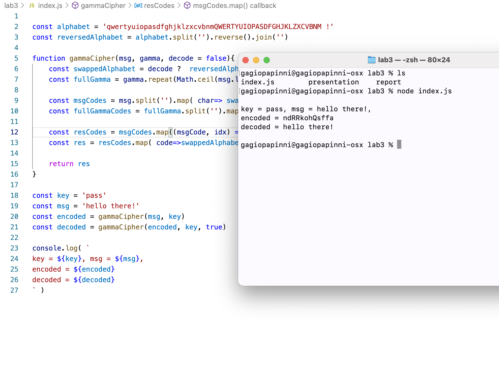

---
# Front matter
title: "Отчёт по лабораторной работе 3"
subtitle: "МОЗИиИБ"
author: "Папикян Гагик Тигранович"

# Generic otions
lang: ru-RU
toc-title: "Содержание"

# Bibliography
# bisbliography: bib/cite.bib
csl: pandoc/csl/gost-r-7-0-5-2008-numeric.csl

# Pdf output format
toc: true # Table of contents
toc_depth: 2
lof: true # List of figures
lot: true # List of tables
fontsize: 12pt
linestretch: 1.5
papersize: a4
documentclass: scrreprt
## I18n
polyglossia-lang:
  name: russian
  options:
	- spelling=modern
	- babelshorthands=true
polyglossia-otherlangs:
  name: english
### Fonts
mainfont: PT Serif
romanfont: PT Serif
sansfont: PT Sans
monofont: PT Mono
mainfontoptions: Ligatures=TeX
romanfontoptions: Ligatures=TeX
sansfontoptions: Ligatures=TeX,Scale=MatchLowercase
monofontoptions: Scale=MatchLowercase,Scale=0.9
## Biblatex
# biblatex: true
# biblio-style: "gost-numeric"
# biblatexoptions:
#   - parentracker=true
#   - backend=biber
#   - hyperref=auto
#   - language=auto
#   - autolang=other*
#   - citestyle=gost-numeric
## Misc options
indent: true
header-includes:
  - \linepenalty=10 # the penalty added to the badness of each line within a paragraph (no associated penalty node) Increasing the value makes tex try to have fewer lines in the paragraph.
  - \interlinepenalty=0 # value of the penalty (node) added after each line of a paragraph.
  - \hyphenpenalty=50 # the penalty for line breaking at an automatically inserted hyphen
  - \exhyphenpenalty=50 # the penalty for line breaking at an explicit hyphen
  - \binoppenalty=700 # the penalty for breaking a line at a binary operator
  - \relpenalty=500 # the penalty for breaking a line at a relation
  - \clubpenalty=150 # extra penalty for breaking after first line of a paragraph
  - \widowpenalty=150 # extra penalty for breaking before last line of a paragraph
  - \displaywidowpenalty=50 # extra penalty for breaking before last line before a display math
  - \brokenpenalty=100 # extra penalty for page breaking after a hyphenated line
  - \predisplaypenalty=10000 # penalty for breaking before a display
  - \postdisplaypenalty=0 # penalty for breaking after a display
  - \floatingpenalty = 20000 # penalty for splitting an insertion (can only be split footnote in standard LaTeX)
  - \raggedbottom # or \flushbottom
  - \usepackage{float} # keep figures where there are in the text
  - \floatplacement{figure}{H} # keep figures where there are in the text
---

# Цель работы

Познакомиться с принципом шифрования через гаммирование, 
посредством реализации алгоритма шифрования с конечной гаммой

# Задание

1) Реализовать алгоритм шифрования конечной гаммой

# Теоретическое введение

## Шифрование гаммированием

Гамми́рование, или Шифр XOR, — метод симметричного шифрования, заключающийся в «наложении» последовательности, состоящей из случайных чисел, на открытый текст. Последовательность случайных чисел называется гамма-последовательностью и используется для зашифровывания и расшифровывания данных. Суммирование обычно выполняется в каком-либо конечном поле.

## Шифрование конечной гаммой
Шифрование конечной гаммой использует определеный ключ маленькой длины, и циклическим его повторением получает гамму, равную по длине входному сообщению


# Выполнение лабораторной работы
Был написан следующий скрипт на javascript

``` {.js filename="../index.js"}

const alphabet = 'qwertyuiopasdfghjklzxcvbnmQWERTYUIOPASDFGHJKLZXCVBNM !'
const reversedAlphabet = alphabet.split('').reverse().join('')

function gammaCipher(msg, gamma, decode = false){
  const swappedAlphabet = decode ? reversedAlphabet : alphabet
  const fullGamma = gamma.repeat(Math.ceil(msg.length / gamma.length))

  const msgCodes = msg.split('').map(char=>swappedAlphabet.indexOf(char))
  const fullGammaCodes = fullGamma.split('').map(char=>alphabet.indexOf(char))

  const resCodes = msgCodes.map((msgCode, idx) 
                            => (msgCode+fullGammaCodes[idx])%alphabet.length)
  const res = resCodes.map( code=>swappedAlphabet[code] ).join('')

  return res
}

const key = 'pass'
const msg = 'hello there!'
const encoded = gammaCipher(msg, key) 
const decoded = gammaCipher(encoded, key, true)

console.log( `
key = ${key}, msg = ${msg}, 
encoded = ${encoded}
decoded = ${decoded}
` )
```

Результат исполнения скрипта приведен на рисунке 1 (рис. [-@fig:001])

{ #fig:001 width=70% }

# Выводы

Был реализован алгоритм шифрования конечной гаммой       
Был использован фиксированный алфавит, состоящий из символов       
"qwertyuiopasdfghjklzxcvbnmQWERTYUIOPASDFGHJKLZXCVBNM !"           


На рисунке 4.1 в окне терминала было показано, как текст "hello there!" зашифровывается и расшифровывается реализованным алгоритмом

<!-- 
# Список литературы{.unnumbered}

::: {#refs}
::: -->
