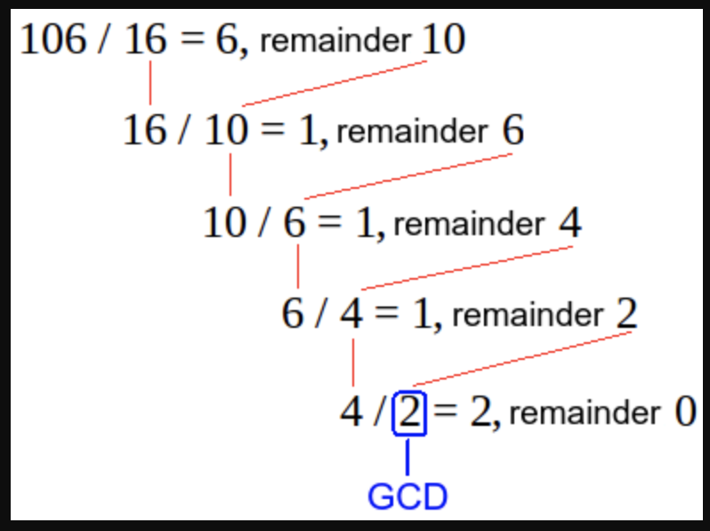
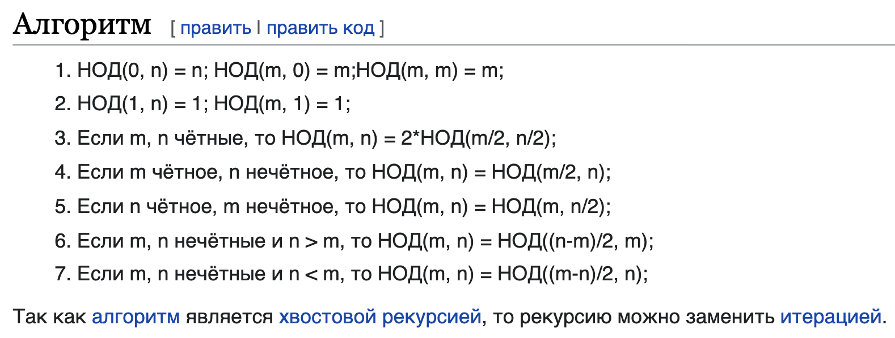
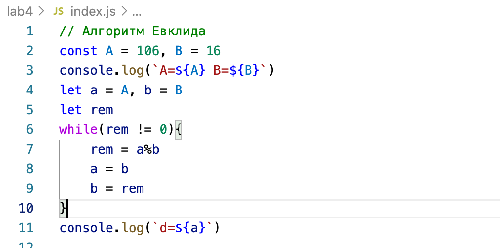

---
## Front matter
lang: ru-RU
title: Наибольший Общий Делитель
author: |
	Gagik T. Papikyan

institute: |
	RUDN University, Moscow, Russian Federation

## Formatting
toc: false
slide_level: 2
# theme: metropolis
header-includes: 
#  - \metroset{progressbar=frametitle,sectionpage=progressbar,numbering=fraction}
 - '\makeatletter'
 - '\beamer@ignorenonframefalse'
 - '\makeatother'
aspectratio: 43
section-titles: true
---

# НОД(Наибольший Общий Делитель)

## Алгоритм Евклида 

{ #fig:01 width=100% }
  

## Бинарный Алгоритм Евклида 

{ #fig:002 width=100% }

## Реализация делением

{ #fig:004 width=110% }

<!-- ## {.standout} -->

<!-- Wer's nicht glaubt, bezahlt einen Taler -->
