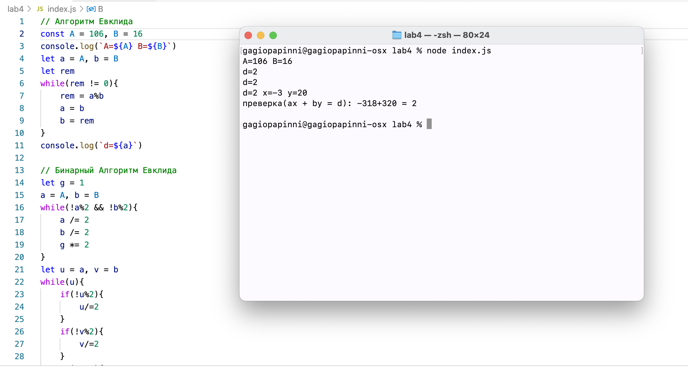

---
# Front matter
title: "Отчёт по лабораторной работе 4"
subtitle: "МОЗИиИБ"
author: "Папикян Гагик Тигранович"

# Generic otions
lang: ru-RU
toc-title: "Содержание"

# Bibliography
# bisbliography: bib/cite.bib
csl: pandoc/csl/gost-r-7-0-5-2008-numeric.csl

# Pdf output format
toc: true # Table of contents
toc_depth: 2
lof: true # List of figures
lot: true # List of tables
fontsize: 12pt
linestretch: 1.5
papersize: a4
documentclass: scrreprt
## I18n
polyglossia-lang:
  name: russian
  options:
	- spelling=modern
	- babelshorthands=true
polyglossia-otherlangs:
  name: english
### Fonts
mainfont: PT Serif
romanfont: PT Serif
sansfont: PT Sans
monofont: PT Mono
mainfontoptions: Ligatures=TeX
romanfontoptions: Ligatures=TeX
sansfontoptions: Ligatures=TeX,Scale=MatchLowercase
monofontoptions: Scale=MatchLowercase,Scale=0.9
## Biblatex
# biblatex: true
# biblio-style: "gost-numeric"
# biblatexoptions:
#   - parentracker=true
#   - backend=biber
#   - hyperref=auto
#   - language=auto
#   - autolang=other*
#   - citestyle=gost-numeric
## Misc options
indent: true
header-includes:
  - \linepenalty=10 # the penalty added to the badness of each line within a paragraph (no associated penalty node) Increasing the value makes tex try to have fewer lines in the paragraph.
  - \interlinepenalty=0 # value of the penalty (node) added after each line of a paragraph.
  - \hyphenpenalty=50 # the penalty for line breaking at an automatically inserted hyphen
  - \exhyphenpenalty=50 # the penalty for line breaking at an explicit hyphen
  - \binoppenalty=700 # the penalty for breaking a line at a binary operator
  - \relpenalty=500 # the penalty for breaking a line at a relation
  - \clubpenalty=150 # extra penalty for breaking after first line of a paragraph
  - \widowpenalty=150 # extra penalty for breaking before last line of a paragraph
  - \displaywidowpenalty=50 # extra penalty for breaking before last line before a display math
  - \brokenpenalty=100 # extra penalty for page breaking after a hyphenated line
  - \predisplaypenalty=10000 # penalty for breaking before a display
  - \postdisplaypenalty=0 # penalty for breaking after a display
  - \floatingpenalty = 20000 # penalty for splitting an insertion (can only be split footnote in standard LaTeX)
  - \raggedbottom # or \flushbottom
  - \usepackage{float} # keep figures where there are in the text
  - \floatplacement{figure}{H} # keep figures where there are in the text
---

# Цель работы

Познакомиться с алгоритмами поиска Наибольшего Общего Делителя(НОД)

# Задание

1) Реализовать алгоритм Евклида
2) Реализовать бинарный алгоритм Евклида
3) Реализовать расширенный бинарный алгоритм Евклида


# Теоретическое введение

## Алгоритм Евклида

Древнегреческие математики называли этот алгоритм ἀνθυφαίρεσις или ἀνταναίρεσις — «взаимное вычитание». Этот алгоритм не был открыт Евклидом, так как упоминание о нём имеется уже в Топике Аристотеля (IV век до н. э.). В «Началах» Евклида он описан дважды — в VII книге для нахождения наибольшего общего делителя двух натуральных чисел и в X книге для нахождения наибольшей общей меры двух однородных величин. В обоих случаях дано геометрическое описание алгоритма, для нахождения «общей меры» двух отрезков.

Историками математики было выдвинуто предположение, что именно с помощью алгоритма Евклида (процедуры последовательного взаимного вычитания) в древнегреческой математике впервые было открыто существование несоизмеримых величин (стороны и диагонали квадрата, или стороны и диагонали правильного пятиугольника). Впрочем, это предположение не имеет достаточных документальных подтверждений. Алгоритм для поиска наибольшего общего делителя двух натуральных чисел описан также в I книге древнекитайского трактата Математика в девяти книгах.

Суть алгоритма заключается в последовательном делении большего числа на меньшее. 
Если остаток от деления равен нулю, то делитель - это НОД
Иначе за большее числа принимается делитель, а за меньшее - остаток, а алгоритм повторяется 

## Бинарный Алгоритм Евклида 
Бинарный алгоритм Евклида использует смещения, а не деление, что дает прирост в производительности 
Так же существует расширенный бинарный алгоритм Евклида, дающий значения х и у, удовлетворяющие уравнению ах+by=d

# Выполнение лабораторной работы
Был написан следующий скрипт на javascript

``` {.js filename="../index.js"}
// Алгоритм Евклида 
const A = 106, B = 16
console.log(`A=${A} B=${B}`)
let a = A, b = B
let rem
while(rem != 0){
    rem = a%b 
    a = b 
    b = rem
}
console.log(`d=${a}`)

// Бинарный Алгоритм Евклида 
let g = 1
a = A, b = B
while(!a%2 && !b%2){
    a /= 2
    b /= 2
    g *= 2
}
let u = a, v = b 
while(u){
    if(!u%2){
        u/=2
    }
    if(!v%2){
        v/=2
    }
    if(u>=v){
        u -= v
    }else{
        v -= u
    }
}
console.log(`d=${g*v}`)

// Расширенный Бинарный Алгоритм Евклида 
g = 1
a = A, b = B
while(!a%2 && !b%2){
    a /= 2
    b /= 2
    g *= 2
}
u = a, v = b 
let a_ = 1, b_ = 0,c_ = 0, d_= 1
while(u){
    if(!u%2){
        u/=2
        if(!a_%2 && !b_%2){
            a_ /= 2
            b_ /= 2
        }else{
            a_ = (a_+b) / 2
            b_ = (b_-a) / 2
        }
    }
    if(!v%2){
        v/=2
        if(!c_%2 && !d_%2){
            c_ /= 2
            d_ /= 2
        }else{
            c_ = (c_+b) / 2
            d_ = (d_-a) / 2
        }
    }
    if(u>=v){
        u -= v
        a_ -= c_
        b_ -= d_
    }else{
        v -= u
        c_ -= a_
        d_ -= b_
    }
}
console.log(`d=${g*v} x=${c_} y=${d_}
преверка(ax + by = d): ${A*c_}+${B*d_} = ${g*v} 
`)

```

Результат исполнения скрипта приведен на рисунке 1 (рис. [-@fig:001])

{ #fig:001 width=70% }

# Выводы

Был реализован алгоритм Евклида, бинарный и расширенный бинарный алгоритмы Евклида
Для примера были использованы числа  A = 106, B = 16, а на рис 4.1 видно, что их НОД = 2

<!-- 
# Список литературы{.unnumbered}

::: {#refs}
::: -->
