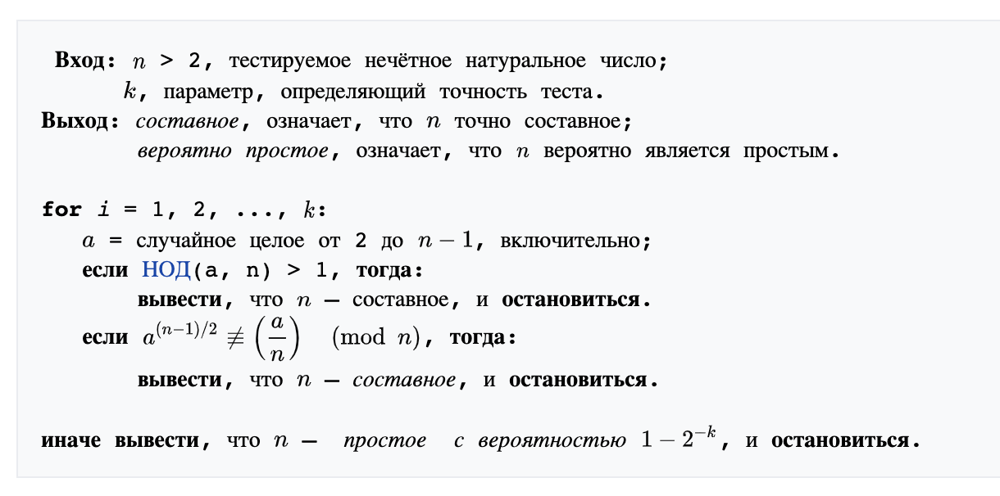
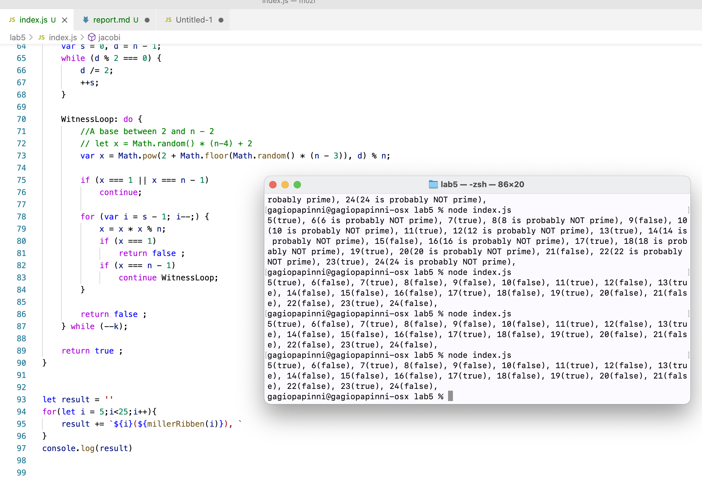

---
# Front matter
title: "Отчёт по лабораторной работе 5"
subtitle: "МОЗИиИБ"
author: "Папикян Гагик Тигранович"

# Generic otions
lang: ru-RU
toc-title: "Содержание"

# Bibliography
# bisbliography: bib/cite.bib
csl: pandoc/csl/gost-r-7-0-5-2008-numeric.csl

# Pdf output format
toc: true # Table of contents
toc_depth: 2
lof: true # List of figures
lot: true # List of tables
fontsize: 12pt
linestretch: 1.5
papersize: a4
documentclass: scrreprt
## I18n
polyglossia-lang:
  name: russian
  options:
	- spelling=modern
	- babelshorthands=true
polyglossia-otherlangs:
  name: english
### Fonts
mainfont: PT Serif
romanfont: PT Serif
sansfont: PT Sans
monofont: PT Mono
mainfontoptions: Ligatures=TeX
romanfontoptions: Ligatures=TeX
sansfontoptions: Ligatures=TeX,Scale=MatchLowercase
monofontoptions: Scale=MatchLowercase,Scale=0.9
## Biblatex
# biblatex: true
# biblio-style: "gost-numeric"
# biblatexoptions:
#   - parentracker=true
#   - backend=biber
#   - hyperref=auto
#   - language=auto
#   - autolang=other*
#   - citestyle=gost-numeric
## Misc options
indent: true
header-includes:
  - \linepenalty=10 # the penalty added to the badness of each line within a paragraph (no associated penalty node) Increasing the value makes tex try to have fewer lines in the paragraph.
  - \interlinepenalty=0 # value of the penalty (node) added after each line of a paragraph.
  - \hyphenpenalty=50 # the penalty for line breaking at an automatically inserted hyphen
  - \exhyphenpenalty=50 # the penalty for line breaking at an explicit hyphen
  - \binoppenalty=700 # the penalty for breaking a line at a binary operator
  - \relpenalty=500 # the penalty for breaking a line at a relation
  - \clubpenalty=150 # extra penalty for breaking after first line of a paragraph
  - \widowpenalty=150 # extra penalty for breaking before last line of a paragraph
  - \displaywidowpenalty=50 # extra penalty for breaking before last line before a display math
  - \brokenpenalty=100 # extra penalty for page breaking after a hyphenated line
  - \predisplaypenalty=10000 # penalty for breaking before a display
  - \postdisplaypenalty=0 # penalty for breaking after a display
  - \floatingpenalty = 20000 # penalty for splitting an insertion (can only be split footnote in standard LaTeX)
  - \raggedbottom # or \flushbottom
  - \usepackage{float} # keep figures where there are in the text
  - \floatplacement{figure}{H} # keep figures where there are in the text
---

# Цель работы

Познакомиться с алгоритмами поиска Наибольшего Общего Делителя(НОД)

# Задание

1) Реализовать алгоритм теста Ферма
2) Реализовать алгоритм Соловэя
3) Реализовать алгоритм Рабина


# Теоретическое введение

## Алгоритм Соловэя
Тест Соловея — Штрассена — вероятностный тест простоты, открытый в 1970-х годах Робертом Мартином Соловеем совместно с Фолькером Штрассеном. Тест всегда корректно определяет, что простое число является простым, но для составных чисел с некоторой вероятностью он может дать неверный ответ. Основное преимущество теста заключается в том, что он, в отличие от теста Ферма, распознает числа Кармайкла как составные.

{ #fig:002 width=70% }

## Алгоритм Рабина
Тест Миллера — Рабина — вероятностный полиномиальный тест простоты. Тест Миллера — Рабина, наряду с тестом Ферма и тестом Соловея — Штрассена, позволяет эффективно определить, является ли данное число составным. Однако, с его помощью нельзя строго доказать простоту числа. Тем не менее тест Миллера — Рабина часто используется в криптографии для получения больших случайных простых чисел.


## Алгоритм Ферма

Тест простоты Ферма в теории чисел — это тест простоты натурального числа n, основанный на малой теореме Ферма.

При использовании алгоритмов быстрого возведения в степень по модулю время работы теста Ферма для одного a оценивается как O(log2n × log log n × log log log n), где n — проверяемое число. Обычно проводится несколько проверок с различными a.


# Выполнение лабораторной работы
Был написан следующий скрипт на javascript

``` {.js filename="../index.js"}
function fermaTest(n){
    // if(n<2) return false
    // if(n in [2,3]) return true
    for(let i =0;i<200;i++){
        const a = Math.random() * (n-4) + 2
        const r = Math.pow(a, n-1) % n
        if(r === 1) return true
    }
    return false    
}

// let result = ''
// for(let i = 5;i<25;i++){
//     result += `${i}(${fermaTest(i)}), `
// }
// console.log(result)

function jacobi(n, k){
    //   assert(k > 0 && k % 2 === 1)
      n = n % k
      let t = 1
      while (n !== 0) {
        while (!n%2){
          n = n / 2
          let r = k % 8
          if(r === 3 || r === 5) t = -t
        }
        [n, k] = [k, n]
        if (n % 4 === 3 && k % 4 === 3) t = -t
        n = n % k
      }
    
      if ( k === 1) 
        return t
      else
        return 0 
}

function solovoyStrassen(p, iteration = 200) {
    for(let i = 0; i<iteration; i++){
        let r = Math.floor(Math.random()*2 );   

        const a = r % (p - 1) + 1
        let j = (p + jacobi(a, p)) % p
        let mod =  Math.pow(a, Math.floor((p-1)/2)) % p

        if(j === 0 || mod != j) return false

    }
    return true
}


// let result = ''
// for(let i = 5;i<25;i++){
//     result += `${i}(${solovoyStrassen(i)}), `
// }
// console.log(result)


function millerRibben(n, k=100) {
    if (n % 2 === 0) return false

	var s = 0, d = n - 1;
	while (d % 2 === 0) {
		d /= 2;
		++s;
	}
 
	WitnessLoop: do {
		//A base between 2 and n - 2
        // let x = Math.random() * (n-4) + 2
        var x = Math.pow(2 + Math.floor(Math.random() * (n - 3)), d) % n;

		if (x === 1 || x === n - 1)
			continue;
 
		for (var i = s - 1; i--;) {
			x = x * x % n;
			if (x === 1)
				return false ;
			if (x === n - 1)
				continue WitnessLoop;
		}
 
		return false ;
	} while (--k);
 
	return true ;
}


let result = ''
for(let i = 5;i<25;i++){
    result += `${i}(${millerRibben(i)}), `
}
console.log(result)


```

Результат исполнения скрипта приведен на рисунке 1 (рис. [-@fig:001])

{ #fig:001 width=70% }

# Выводы

Были реализованы приведенные алгоритмы, и продемонстирован результат их выполнения

<!-- 
# Список литературы{.unnumbered}

::: {#refs}
::: -->
