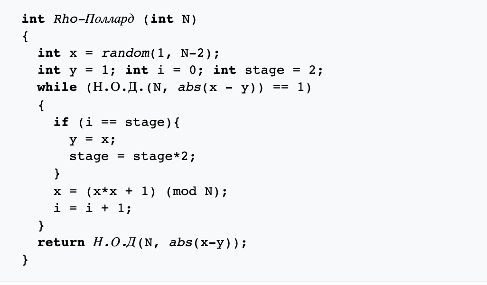

---
## Front matter
lang: ru-RU
title: ро-Алгоритм Полларда 
author: |
	Gagik T. Papikyan

institute: |
	RUDN University, Moscow, Russian Federation

## Formatting
toc: false
slide_level: 2
# theme: metropolis
header-includes: 
#  - \metroset{progressbar=frametitle,sectionpage=progressbar,numbering=fraction}
 - '\makeatletter'
 - '\beamer@ignorenonframefalse'
 - '\makeatother'
aspectratio: 43
section-titles: true
---

# ро-Алгоритм Полларда 

## Введение
Ро-алгоритм — предложенный Джоном Поллардом в 1975 году алгоритм, служащий для факторизации (разложения на множители) целых чисел. Данный алгоритм основывается на алгоритме Флойда поиска длины цикла в последовательности и некоторых следствиях из парадокса дней рождения. Алгоритм наиболее эффективен при факторизации составных чисел с достаточно малыми множителями в разложении. Сложность алгоритма оценивается как O(N^{1/4})
  

## Алгоритм

{ #fig:002 width=100% }

<!-- ## {.standout} -->

<!-- Wer's nicht glaubt, bezahlt einen Taler -->
