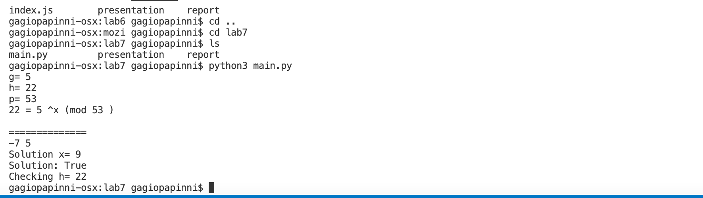

---
# Front matter
title: "Отчёт по лабораторной работе 7"
subtitle: "МОЗИиИБ"
author: "Папикян Гагик Тигранович"

# Generic otions
lang: ru-RU
toc-title: "Содержание"

# Bibliography
# bisbliography: bib/cite.bib
csl: pandoc/csl/gost-r-7-0-5-2008-numeric.csl

# Pdf output format
toc: true # Table of contents
toc_depth: 2
lof: true # List of figures
lot: true # List of tables
fontsize: 12pt
linestretch: 1.5
papersize: a4
documentclass: scrreprt
## I18n
polyglossia-lang:
  name: russian
  options:
	- spelling=modern
	- babelshorthands=true
polyglossia-otherlangs:
  name: english
### Fonts
mainfont: PT Serif
romanfont: PT Serif
sansfont: PT Sans
monofont: PT Mono
mainfontoptions: Ligatures=TeX
romanfontoptions: Ligatures=TeX
sansfontoptions: Ligatures=TeX,Scale=MatchLowercase
monofontoptions: Scale=MatchLowercase,Scale=0.9
## Biblatex
# biblatex: true
# biblio-style: "gost-numeric"
# biblatexoptions:
#   - parentracker=true
#   - backend=biber
#   - hyperref=auto
#   - language=auto
#   - autolang=other*
#   - citestyle=gost-numeric
## Misc options
indent: true
header-includes:
  - \linepenalty=10 # the penalty added to the badness of each line within a paragraph (no associated penalty node) Increasing the value makes tex try to have fewer lines in the paragraph.
  - \interlinepenalty=0 # value of the penalty (node) added after each line of a paragraph.
  - \hyphenpenalty=50 # the penalty for line breaking at an automatically inserted hyphen
  - \exhyphenpenalty=50 # the penalty for line breaking at an explicit hyphen
  - \binoppenalty=700 # the penalty for breaking a line at a binary operator
  - \relpenalty=500 # the penalty for breaking a line at a relation
  - \clubpenalty=150 # extra penalty for breaking after first line of a paragraph
  - \widowpenalty=150 # extra penalty for breaking before last line of a paragraph
  - \displaywidowpenalty=50 # extra penalty for breaking before last line before a display math
  - \brokenpenalty=100 # extra penalty for page breaking after a hyphenated line
  - \predisplaypenalty=10000 # penalty for breaking before a display
  - \postdisplaypenalty=0 # penalty for breaking after a display
  - \floatingpenalty = 20000 # penalty for splitting an insertion (can only be split footnote in standard LaTeX)
  - \raggedbottom # or \flushbottom
  - \usepackage{float} # keep figures where there are in the text
  - \floatplacement{figure}{H} # keep figures where there are in the text
---

# Цель работы

Познакомиться с алгоритмом Полларда для дискретного логарифмирования в конечном поле

# Задание

1) Реализовать алгоритм Полларда


# Теоретическое введение

## Алгоритм Полларда
Ро-алгоритм — предложенный Джоном Поллардом в 1975 году алгоритм, служащий для факторизации (разложения на множители) целых чисел. Данный алгоритм основывается на алгоритме Флойда поиска длины цикла в последовательности и некоторых следствиях из парадокса дней рождения. Алгоритм наиболее эффективен при факторизации составных чисел с достаточно малыми множителями в разложении. Сложность алгоритма оценивается как O(N^{1/4}).

ρ-алгоритм Полларда строит числовую последовательность, элементы которой образуют цикл, начиная с некоторого номера n, что может быть проиллюстрировано, расположением чисел в виде греческой буквы ρ, что послужило названием семейству алгоритмов


# Выполнение лабораторной работы
Был написан следующий скрипт на python

``` {.py filename="../main.py"}
import sys

def ext_euclid(a, b):
    """
    Extended Euclidean Algorithm
    :param a:
    :param b:
    :return:
    """
    if b == 0:
        return a, 1, 0
    else:
        d, xx, yy = ext_euclid(b, a % b)
        x = yy
        y = xx - (a / b) * yy
        return d, x, y


def xab(x, a, b, G, H, P, Q):
    """
    Pollard Step
    :param x:
    :param a:
    :param b:
    :return:
    """
    sub = x % 3 # Subsets

    if sub == 0:
        x = x*G % P
        a = (a+1) % Q

    if sub == 1:
        x = x * H % P
        b = (b + 1) % Q

    if sub == 2:
        x = x*x % P
        a = a*2 % Q
        b = b*2 % Q

    return x, a, b


def pollard(G, H, P):

    # P: prime
    # H:
    # G: generator
    Q = (P - 1) / 2  # sub group


    x = G*H
    a = 1
    b = 1

    X = x
    A = int(a)
    B = int(b)

    # Do not use range() here. It makes the algorithm amazingly slow.
    for i in range(1, P):
        # Who needs pass-by reference when you have Python!!! ;)

        # Hedgehog
        x, a, b = xab(x, a, b, G, H, P, Q)

        # Rabbit
        X, A, B = xab(X, A, B, G, H, P, Q)
        X, A, B = xab(X, A, B, G, H, P, Q)

        if x == X:
            break


    nom = int(a-A)
    denom = int(B-b)

    print (nom, denom)

    # It is necessary to compute the inverse to properly compute the fraction mod q
    res = ( ext_euclid(denom, int(Q) * nom)[1] % int(Q))

    # I know this is not good, but it does the job...
    if verify(G, H, P, res):
        return res

    return int(res + Q)


def verify(g, h, p, x):
    """
    Verifies a given set of g, h, p and x
    :param g: Generator
    :param h:
    :param p: Prime
    :param x: Computed X
    :return:
    """
    return pow(int(g), int(x), p) == h

g=int(5)
h=int(22)
p=int(53)


print ("g=",g)
print ("h=",h)
print ("p=",p)

print (h,"=",g,"^x (mod",p,")")
print ("\n==============")

x = int(pollard(g,h,p))
print ("Solution x=",x)

print ("Solution:",verify(g, h, p, x))
print ("Checking h=",pow(int(g), int(x), p))

```

Результат исполнения скрипта приведен на рисунке 1 (рис. [-@fig:001])

{ #fig:001 width=70% }

# Выводы

Были реализован  алгоритм, и продемонстирован результат его выполнения

<!-- 
# Список литературы{.unnumbered}

::: {#refs}
::: -->
